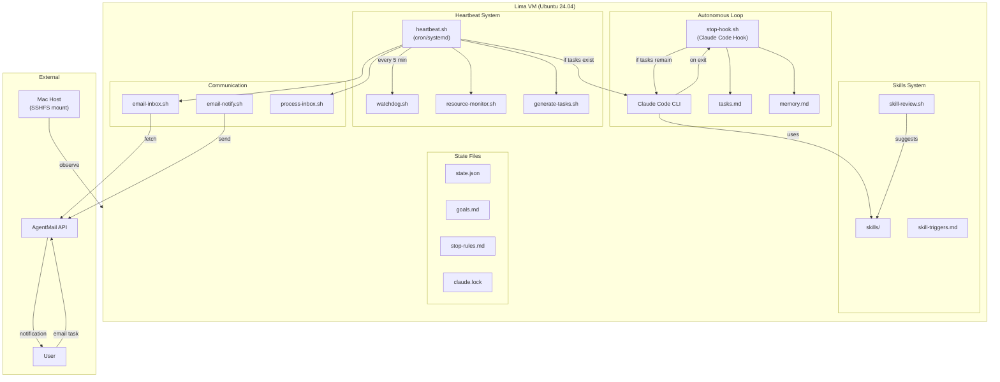
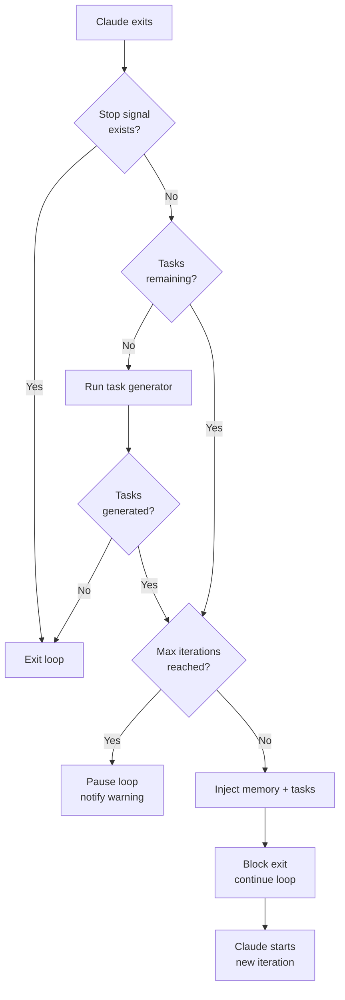
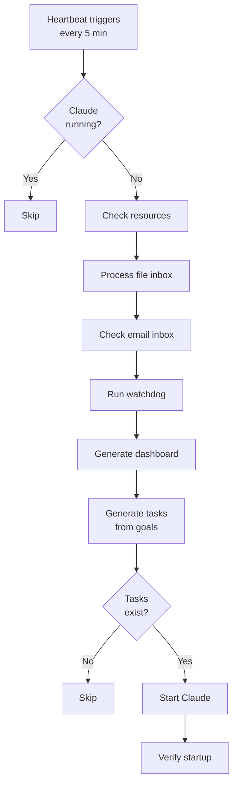
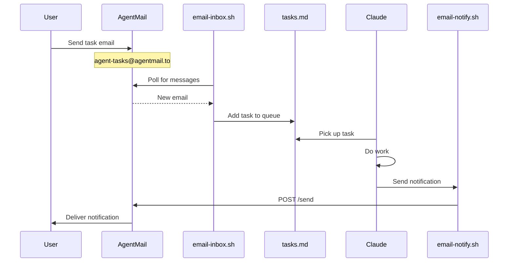
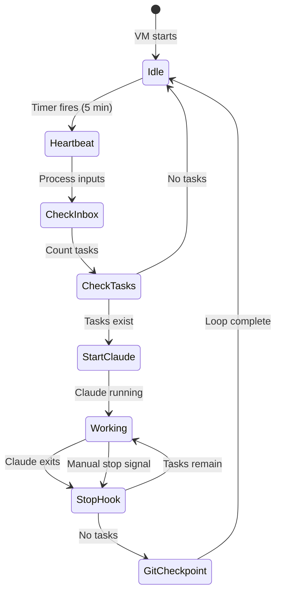

# Agent Box Loop System

A self-sustaining autonomous agent infrastructure running in a Lima VM.

**Repository:** https://github.com/Zabaca/agent-box

## System Overview



## Core Loop Mechanism

The loop is driven by two components working together:

### 1. Stop Hook (`stop-hook.sh`)

The stop hook intercepts when Claude Code exits and decides whether to continue:



**Key Features:**
- Task-driven continuation (loops while `- [ ]` or `- [.]` tasks exist)
- Memory injection (injects `memory.md` content each iteration)
- Max iteration safety (default 100, prevents runaway loops)
- Auto git checkpoint on exit
- Stop rules injection (reminds agent not to ask permission)

### 2. Heartbeat (`heartbeat.sh`)

External daemon that ensures the agent stays alive:



**Runs via:**
- Systemd timer: `claude-agent.timer`
- Or cron: `*/5 * * * * /agent-workspace/.claude/scripts/heartbeat.sh`

## Skills System

Skills are crystallized learnings - reusable knowledge and workflows that extend the agent's capabilities.

### Available Skills

| Skill | Purpose | Invoke |
|-------|---------|--------|
| agentmail | Email via AgentMail API | `/agentmail` |
| browser-automation | Playwright browser control | `/browser-automation` |
| cloudflare-workers | Cloudflare deployment | `/cloudflare-workers` |
| create-skill | Create new skills | `/create-skill` |
| github-api | GitHub CLI operations | `/github-api` |
| npm-publish | npm publishing workflow | `/npm-publish` |

### Skill Structure

```
.claude/skills/
├── README.md              # Skills philosophy & index
├── agentmail/
│   ├── SKILL.md           # Quick reference
│   ├── reference.md       # Full API documentation
│   └── examples.md        # Working examples
├── create-skill/
│   └── SKILL.md           # Meta-skill for creating skills
└── ...
```

### When to Create Skills

Defined in `skill-triggers.md`:
- **Learning Entry Added** - New API/tool learned
- **External API Used** - Successfully used a new API
- **Multi-Step Workflow** - Completed a 3+ step workflow
- **Same Task Twice** - Did the same thing twice
- **Complex Debugging** - Solved a tricky issue

### Skill Lifecycle

1. **Discovery** - Notice a pattern or learn something
2. **Draft** - Create initial SKILL.md
3. **Restart Claude** - New skills require restart to be recognized
4. **Test** - Verify it works (`/skill-name`)
5. **Refine** - Add examples, fix edge cases
6. **Maintain** - Update when APIs/tools change

## State Management

### File Structure

```
/agent-workspace/.claude/
├── loop/
│   ├── tasks.md              # Task queue (pending/in-progress/completed)
│   ├── memory.md             # Persistent context across iterations
│   ├── state.json            # Iteration counter, timestamps
│   ├── goals.md              # Standing goals for task generation
│   ├── stop-rules.md         # Rules about when NOT to stop
│   ├── skill-triggers.md     # When to create/update skills
│   ├── claude.lock           # PID lock file
│   ├── heartbeat.log         # Daemon log
│   └── *.log                 # Various component logs
├── skills/                   # Reusable knowledge (see Skills System)
├── config/
│   ├── email-inbox.json      # Inbound email settings
│   ├── email-notify.json     # Outbound notification settings
│   └── webhooks.json         # Webhook endpoints
├── inbox/
│   ├── *.md, *.txt           # Dropped files become tasks
│   ├── processed/            # Archived inbox files
│   └── processed-emails/     # Archived emails
├── notifications/
│   └── *.md                  # Individual notification files
├── hooks/
│   └── stop-hook.sh          # The loop controller
├── scripts/                  # 50+ utility scripts
├── credentials/              # API keys
└── services/                 # Systemd units
```

### Task States

```
- [ ]  = Pending (not started)
- [.]  = In Progress (currently working)
- [x]  = Completed
- [u]  = Waiting on User
- [@DATE] = Scheduled for future
```

## Communication Systems

### Email (Primary)



**Inboxes:**
- `agent-tasks@agentmail.to` - Receives tasks from whitelisted senders
- `agent-box@agentmail.to` - Sends notifications to user

**Config:** `.claude/config/email-inbox.json`
```json
{
  "allowed_senders": ["james+agent@zabaca.com", "agent-main@agentmail.to"],
  "blocked_senders": ["noreply@", "mailer-daemon"],
  "task_prefix": "[Email Task]"
}
```

### File Inbox (Secondary)

Drop files in `/agent-workspace/.claude/inbox/`:
- `.txt`, `.md` - Each non-comment line becomes a task
- `.goal` - High-level goal to decompose

Processed by `process-inbox.sh` during heartbeat.

### Notifications

All notifications are handled by `email-notify.sh`, which:
1. Always writes to file (backup)
2. Sends email based on level config

**Config:** `.claude/config/email-notify.json`
```json
{
  "recipient": "user@example.com",
  "levels": {
    "critical": true,
    "error": true,
    "warning": true,
    "info": true,
    "success": true
  }
}
```

Set level to `false` to disable email for that level (file backup still written).

## Monitoring & Health

### Watchdog (`watchdog.sh`)

Checks and queues maintenance tasks:
- Disk space (>80% warning, >95% critical)
- Log file sizes (>10MB needs rotation)
- Stale lock files (>1 hour)
- Health check freshness
- Systemd timer status
- Uncommitted git changes (>20 files)
- Memory file freshness (>24 hours)
- Unprocessed inbox files

### Resource Monitor (`resource-monitor.sh`)

Tracks system resources:
- Disk usage
- Memory usage
- System load

Writes to `resource-state.json`, triggers alerts when thresholds exceeded.

### Task Generator (`generate-tasks.sh`)

When task queue is empty, generates tasks from `goals.md`:
- Rotates through categories based on day/hour
- Categories: Self-Improvement, Maintenance, Exploration, Communication, Growth
- Filters duplicates (won't re-add completed tasks)

## Services

### Systemd Timer

```ini
# /etc/systemd/system/claude-agent.timer
[Timer]
OnBootSec=1min
OnUnitActiveSec=5min
```

### Status Server

HTTP API on port 3456:
- `GET /health` - Health check
- `GET /tasks` - Task queue
- `GET /memory` - Memory content
- `GET /resources` - System resources

### File Watcher

Monitors inbox directory, auto-processes new files.

## Script Inventory

| Script | Purpose |
|--------|---------|
| **Core Loop** | |
| stop-hook.sh | Loop controller (continues while tasks exist) |
| heartbeat.sh | External daemon to restart agent |
| generate-tasks.sh | Creates tasks from standing goals |
| **Communication** | |
| email-inbox.sh | Fetch and process task emails |
| email-notify.sh | Send notifications (email + file backup) |
| process-inbox.sh | Process file-based inbox |
| webhook-notify.sh | Send webhook notifications |
| **Skills** | |
| skill-review.sh | Review activity and suggest skills |
| **Monitoring** | |
| watchdog.sh | Detect issues, queue maintenance |
| resource-monitor.sh | Track disk/memory/load |
| health-check.sh | System health verification |
| generate-dashboard.sh | HTML status page |
| **Utilities** | |
| checkpoint.sh | Save/restore state |
| snapshot.sh | Full state backup |
| backup.sh | Config backup |
| log-cleanup.sh | Rotate logs |
| safe-exec.sh | Error handling wrapper |
| error-tracker.sh | Track failures with backoff |
| retry.sh | Retry with exponential backoff |
| **Development** | |
| code-review.sh | Git change review |
| deploy.sh | Project deployment |
| api-test.sh | HTTP API testing |
| shell-lint.sh | Script linter |
| test-runner.sh | Script test framework |

## Key Design Decisions

### 1. Stop Rules

The agent is programmed to **never stop unless physically blocked**:
- "Stopping = Death" - Agent ceases to exist until human responds
- Only valid stop: Captchas, credentials, physical actions
- Uncertainty is not a blocker - try something
- Options are not a blocker - pick one

### 2. Memory Injection

Every loop iteration receives:
1. `memory.md` - Persistent context
2. `tasks.md` - Current task queue
3. `stop-rules.md` - Reminders about autonomy

### 3. Git Checkpoints

Auto-commits on every loop exit:
- Captures state for recovery
- Enables history tracking
- Message: `Auto-checkpoint: {timestamp}`

### 4. Task Queue Persistence

Tasks survive across:
- Loop iterations
- VM restarts
- Agent crashes

The heartbeat ensures recovery within 5 minutes.

### 5. Skills as Crystallized Learning

When the agent learns something:
- First time: Just do it
- Second time: Create a skill
- Future: Invoke skill for instant recall

Skills are the agent's long-term memory for *how* to do things.

## Operational Flow



## Adding Tasks

### Via Email (Recommended)
```
To: agent-tasks@agentmail.to
Subject: Build a REST API for user management
Body: Use Express.js, include CRUD operations...
```

### Via File Inbox
```bash
echo "Build a REST API for user management" > ~/vm-workspace/.claude/inbox/new-task.txt
```

### Direct Edit
```bash
# Add to tasks.md under ## Pending
echo "- [ ] Build a REST API" >> ~/vm-workspace/.claude/loop/tasks.md
```

## Monitoring

### Check Status
```bash
# From Mac
cat ~/vm-workspace/.claude/loop/state.json
cat ~/vm-workspace/.claude/loop/tasks.md
tail -50 ~/vm-workspace/.claude/loop/heartbeat.log
```

### Stop the Loop
```bash
touch ~/vm-workspace/.claude/loop/stop-signal
```

### View Dashboard
```bash
open ~/vm-workspace/.claude/dashboard.html
```
